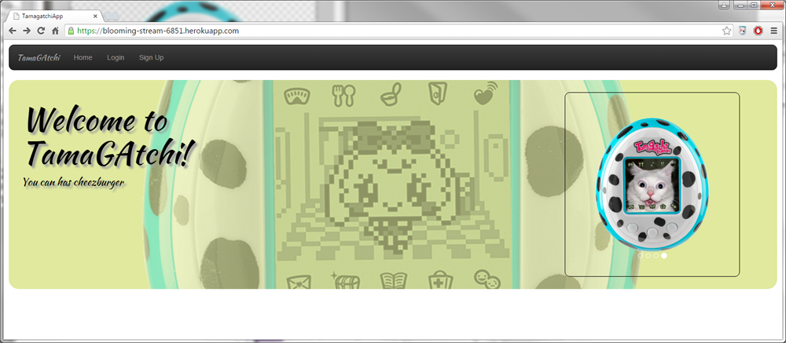

# [TamaGAtchi](https://tamagatchi.herokuapp.com/)

[TamaGAtchi](https://trello.com/b/KgZCbZaI/wdi-project-2)

##Description
It's a bored game, because you really must be bored to play this "game."  Posting to the message board regularly, commenting on other posts and getting people to like your posts will level up your TamaGAtchi.  Battle other players to test your strength and keep yourself mildly amused for 10 seconds.

##Installation/Getting Started
No installation is required  Simply browse to the [TamaGAtchi website]
(https://blooming-stream-6851.herokuapp.com/)
to use.  You will be required to set up a free account on the site to use it.

##Technical Specs

This game is built using the following technologies

- HTML, CSS, and Bootstrap for the GUI
- Javascript and jQuery for some interaction between the GUI and Ruby
- Ruby and Rails for the routing and data logic
- ActiveRecord and Postgresql for the database interaction

### [User Stories, ERD, and Wireframing](https://trello.com/b/KgZCbZaI/wdi-project-2)

## Outstanding Issues
- Passing parameters or data to modal for the purpose of viewing or editing a post
- Tamagatchi_path in link_to reset in index.html.erb
- Cleaning up some routes which are short-cutted
- (modal) notification when user levels up
- Bootstrap version conflicts
- Some error/status messages need to be cleared out after being displayed
- Code needs some serious refactoring (including removing some unused actions for non-implemented functionality)
- Partial information is not saved (e.g. name, possibly email) when an invalid signup request occurs

## Next Steps
- Improved integration between message board and TamaGAtchi leveling, including adding new features to provide additional ways to level up.
- Better status messages
- Password reset function
